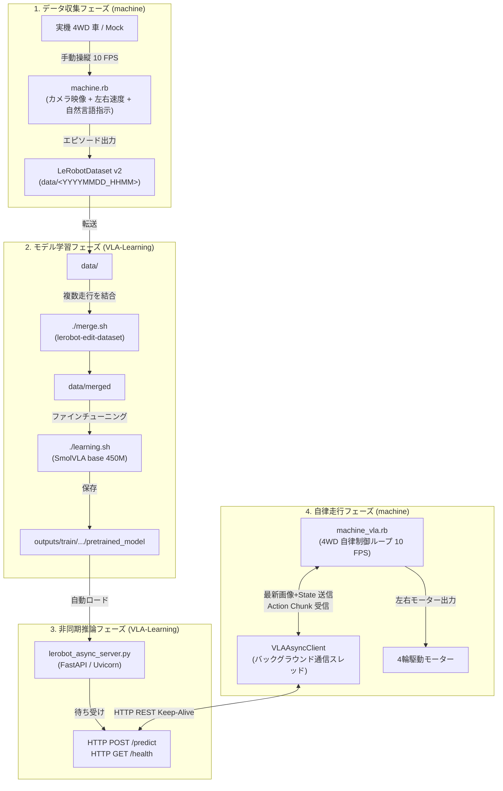

# VLA-Learning: SmolVLA (LeRobot) 学習 & 非同期推論サーバー

[](https://www.python.org/downloads/)
[](https://github.com/huggingface/lerobot)
[](https://huggingface.co/lerobot/smolvla_base)
[](https://fastapi.tiangolo.com/)
[](LICENSE)

4輪駆動ロボットカー向けの **Vision-Language-Action (VLA) モデル「SmolVLA」** のファインチューニング学習基盤および、低遅延で連続走行を実現する **HTTP (REST API) 非同期推論サーバー** です。

実機ロボットカー（Raspberry Pi 搭載車）または Mock クライアント（[`machine`](../machine)）からのカメラ画像と走行状態を受け取り、SmolVLA モデルが予測した制御アクション（左右モーター速度）のチャンクを高速に返信します。

---

## 目次
- [全体アーキテクチャ](#全体アーキテクチャ)
- [ディレクトリ・ファイル構成](#ディレクトリファイル構成)
- [システム要件とセットアップ](#システム要件とセットアップ)
- [推論サーバーの起動方法](#推論サーバーの起動方法)
  - [1. 起動スクリプト (推奨)](#1-起動スクリプト-推奨)
  - [2. Python 直接起動](#2-python-直接起動)
  - [3. 推論 API 仕様 (REST)](#3-推論-api-仕様-rest)
- [データセット準備とモデル学習](#データセット準備とモデル学習)
  - [ステップ 1: データ収集データの配置](#ステップ-1-データ収集データの配置)
  - [ステップ 2: データセットのマージ](#ステップ-2-データセットのマージ)
  - [ステップ 3: SmolVLA 学習実行](#ステップ-3-smolvla-学習実行)
  - [補助スクリプト (convert_py)](#補助スクリプト-convert_py)
- [パラメータ詳解と公式サイト出典](#パラメータ詳解と公式サイト出典)
  - [1. 学習パラメータ (`learning.sh`)](#1-学習パラメータ-learningsh)
  - [2. 推論サーバーパラメータ (`lerobot_async_server.py`)](#2-推論サーバーパラメータ-lerobot_async_serverpy)
- [公式ドキュメント・関連リンク](#公式ドキュメント関連リンク)
- [トラブルシューティング](#トラブルシューティング)

---

## 全体アーキテクチャ

本システムは、GPU を備えた **学習・推論ホストサーバー (`VLA-Learning`)** と、車載コンピュータ **Raspberry Pi 実機 / ローカル開発PC (`machine`)** の2つのコンポーネントで構成されます。



### 非同期推論 & Receding Horizon 制御の仕組み
ロボットカーが停止することなく滑らかに連続走行するため、以下の最適化を行っています。
1. **クライアント側のバックグラウンド先行推論**:
   走行ループ（10 FPS）をブロックせず、アクションキューの残りが 1 ステップ以下になった時点で、バックグラウンドスレッドが最新フレームをサーバーへ非同期送信します。
2. **アクションチャンク生成（Receding Horizon）**:
   モデルは 1 回の推論で先頭 10 ステップ（約 1.0 秒分）の行動計画を生成し、ロボットは計画を順次実行しながら次の推論結果を途切れなく受け取ります。

---

## ディレクトリ・ファイル構成

このリポジトリの主要ファイルと役割は以下の通りです。

```
VLA-Learning/
├── README.md                  # 本ドキュメント
├── learning.sh                # SmolVLA ファインチューニング学習実行シェルスクリプト
├── merge.sh                   # 複数エピソードのデータセットを1つにマージするスクリプト
├── run_server.sh              # 推論サーバー起動スクリプト (Conda環境自動適用)
├── lerobot_async_server.py    # FastAPI ベースの SmolVLA HTTP 非同期推論サーバー本体
├── setup_lerobot_env.sh       # Python 3.12 + LeRobot 依存関係のセットアップスクリプト
├── convert_py/                # データセット変換・メタデータ補正用 Python スクリプト群
│   ├── rescale_dataset_to_1.py # アクション/状態値を [-100, 100] から [-1.0, 1.0] にリスケール
│   ├── json_to_parquet.py     # tasks.jsonl を tasks.parquet へ変換
│   ├── add_task_index.py      # タスクインデックスの付与
│   └── make_stats_json.py     # データセットの正規化統計情報 (stats.json) を再生成
├── bash/
│   └── taskcheck.sh           # データセット内のタスク構成確認スクリプト
├── data/                      # 収集・変換した学習用データセット配置ディレクトリ (git無視)
│   ├── <YYYYMMDD_HHMM>/       # 各走行回ごとのデータセット (meta/, data/, videos/)
│   └── merged/                # merge.sh で統合されたマージ済みデータセット
├── outputs/                   # 学習成果物・推論ログの出力ディレクトリ (git無視)
│   ├── train/                 # 学習済みモデル・チェックポイント (pretrained_model/)
│   └── chunk_logs/            # 推論サーバーが記録した実行時ログ (JSONL)
└── lerobot/                   # Hugging Face LeRobot ソースコード (ローカルツリー)
```

---

## システム要件とセットアップ

### 推奨環境
- **OS**: Linux (Ubuntu 20.04 / 22.04 LTS 等)
- **GPU**: NVIDIA GPU (CUDA 12.x 対応、VRAM 8GB 以上推奨)
- **Package Manager**: [Miniforge](https://github.com/conda-forge/miniforge) または Conda

### 環境構築手順

1. **リポジトリのクローン**
   ```bash
   git clone https://github.com/paisyaluAI/VLA-Learning.git
   cd VLA-Learning
   ```

2. **セットアップスクリプトの実行**
   [`setup_lerobot_env.sh`](setup_lerobot_env.sh) を実行すると、Python 3.12 の Conda 仮想環境 `lerobot` が作成され、SmolVLA に必要な依存関係がインストールされます。
   ```bash
   chmod +x setup_lerobot_env.sh learning.sh merge.sh run_server.sh
   ./setup_lerobot_env.sh
   ```

3. **（手動セットアップを行う場合）**
   ```bash
   conda create -n lerobot python=3.12 -y
   conda activate lerobot
   pip install --upgrade pip
   pip install -e "./lerobot[dataset,training,smolvla]"
   pip install fastapi uvicorn opencv-python pydantic pandas pyarrow
   ```

---

## 推論サーバーの起動方法

### 1. 起動スクリプト (推奨)
[`run_server.sh`](run_server.sh) を使用すると、Conda 環境の自動アクティベートと最新モデルの自動探索が行われます。

```bash
# 基本起動 (すべてのインターフェース 0.0.0.0 の ポート 8080 でリッスン、最新モデルを自動ロード)
./run_server.sh 0.0.0.0 8080

# 引数の指定形式: ./run_server.sh [HOST] [PORT] [CHECKPOINT_PATH] [DEVICE]
# 例: 特定のチェックポイントと GPU (cuda) を指定して起動
./run_server.sh 0.0.0.0 8080 outputs/train/ruby_physicalAI_<timestamp>/checkpoints/last/pretrained_model cuda
```

### 2. Python 直接起動
環境変数を細かく制御したい場合は、直接 [`lerobot_async_server.py`](lerobot_async_server.py) を実行します。

```bash
conda activate lerobot

# 自動検出される最新モデルで起動
python lerobot_async_server.py --host 0.0.0.0 --port 8080

# オプションを明示指定して起動
python lerobot_async_server.py \
  --host 0.0.0.0 \
  --port 8080 \
  --checkpoint outputs/train/ruby_physicalAI_<timestamp>/checkpoints/last/pretrained_model \
  --task "Go to the blue star" \
  --create-steps 10 \
  --exec-steps 10 \
  --timeout-keep-alive 65 \
  --device cuda
```

### 3. 推論 API 仕様 (REST)

推論サーバーは HTTP/1.1 REST API を提供します。

#### ヘルスチェック: `GET /health`
- **Response**: `{"status": "ok"}`

#### アクション推論: `POST /predict`
- **Request Body (JSON)**:
  ```json
  {
    "image": "<Base64 エンコードされた JPEG/PNG 画像文字列>",
    "state": [0.0, 0.0],
    "task": "Go to the blue star",
    "mode": "production",
    "source_desc": "Live Camera",
    "create_steps": 10,
    "exec_steps": 10
  }
  ```
- **Response Body (JSON)**:
  ```json
  {
    "type": "action_chunk",
    "task": "Go to the blue star",
    "action_chunk": [
      [0.65, 0.62],
      [0.64, 0.61],
      [0.60, 0.58]
    ],
    "full_action_chunk": [
      [0.65, 0.62],
      [0.64, 0.61],
      [0.60, 0.58],
      [0.55, 0.52]
    ],
    "inference_latency_ms": 42.15
  }
  ```
  - `action_chunk`: クライアントが実際に実行する左右モーター速度 `[-1.0, 1.0]` の配列（長さ `exec_steps`）。
  - `inference_latency_ms`: サーバー側の純粋な推論所要時間（ミリ秒）。
  - すべての推論履歴は `outputs/chunk_logs/chunk_log_<timestamp>.jsonl` に自動保存されます。

---

## データセット準備とモデル学習

実機または Mock の [`machine.rb`](../machine) で記録したエピソードから、SmolVLA モデルを学習するパイプラインです。

### ステップ 1: データ収集データの配置
[`machine.rb`](../machine) を実行すると、`library/output_dataset/<YYYYMMDD_HHMM>` にデータセットが生成されます。これを本リポジトリの `data/` 配下にコピーまたは移動します。

```bash
# 配置例:
cp -r /path/to/machine/library/output_dataset/<YYYYMMDD_HHMM> data/
```

データセットは以下の **LeRobotDataset v2** 準拠フォーマットです。
```
data/<YYYYMMDD_HHMM>/
├── meta/
│   ├── info.json       # データセットのメタ情報 (fps, 特徴量定義)
│   ├── stats.json      # 正規化用の平均・最小・最大・標準偏差
│   ├── tasks.parquet   # タスク指示文字列の一覧
│   └── episodes/       # 各エピソードのインデックス情報
├── data/
│   └── chunk-000/      # action, state, timestamp 等を含む Parquet
└── videos/
    └── rgb/            # カメラ映像 (MP4 形式)
```

### ステップ 2: データセットのマージ
複数の走行セッションで記録したデータセットを 1 つに結合します。
[`merge.sh`](merge.sh) は `data/` 配下の `YYYYMMDD_HHMM` 形式のディレクトリを自動検出し、LeRobot CLI (`lerobot-edit-dataset`) を呼び出して `data/merged` にマージします。

```bash
./merge.sh
```

### ステップ 3: SmolVLA 学習実行
マージ済みデータセット（または単一データセット）を指定して学習を開始します。

```bash
# ./learning.sh <データセットパス>
./learning.sh data/merged
```

学習チェックポイントは `outputs/train/ruby_physicalAI_<timestamp>/` 配下に保存されます。
最新モデルの重みは `checkpoints/last/pretrained_model/` に配置され、推論サーバーで即座に利用可能となります。

### 補助スクリプト (`convert_py/`)
| スクリプト | 用途 |
| :--- | :--- |
| [`convert_py/rescale_dataset_to_1.py`](convert_py/rescale_dataset_to_1.py) | アクション値が旧仕様（`-100`〜`100`）で記録された Parquet および `stats.json` を、新仕様（`-1.0`〜`1.0`）に一括変換します。 |
| [`convert_py/json_to_parquet.py`](convert_py/json_to_parquet.py) | 古いフォーマットで出力された `meta/tasks.jsonl` を LeRobot 標準の `tasks.parquet` に変換します。 |
| [`convert_py/make_stats_json.py`](convert_py/make_stats_json.py) | Parquet データから `meta/stats.json`（正規化用統計量）を再計算・更新します。 |

---

## パラメータ詳解と公式サイト出典

### 1. 学習パラメータ (`learning.sh`)

[`learning.sh`](learning.sh) 内で実行される `python -m lerobot.scripts.lerobot_train`（または `lerobot-train` CLI）の引数一覧です。

| パラメータ | 設定値 | 説明 | 公式ドキュメント・出典 |
| :--- | :--- | :--- | :--- |
| `--dataset.root` | `"$DATASET_ROOT"` | 学習に使用するデータセットのローカルルートディレクトリ。 | [LeRobot Datasets](https://huggingface.co/docs/lerobot/en/datasets) |
| `--dataset.repo_id` | `"$DATASET_ROOT"` | データセットのリポジトリ識別子。ローカルパスをそのまま渡して識別します。 | [LeRobot Train Config](https://huggingface.co/docs/lerobot/en/advanced_training) |
| `--dataset.use_imagenet_stats` | `false` | 画像の正規化に ImageNet の統計量（mean/std）を使わず、データセット独自の `stats.json` を使用します。 | [LeRobot Preprocessing](https://huggingface.co/docs/lerobot) |
| `--tolerance_s` | `0.1` | フレーム取得時のタイムスタンプ許容誤差（秒）。データセット結合時や実機収集時のフレームレート揺らぎによるロードエラーを防ぎます。 | [LeRobot Dataset Sync](https://huggingface.co/docs/lerobot/en/datasets) |
| `--policy.path` | `lerobot/smolvla_base` | ファインチューニングのベースとなる事前学習済み SmolVLA モデル（450M パラメータ）。 | [SmolVLA Model Card](https://huggingface.co/lerobot/smolvla_base) |
| `--policy.push_to_hub` | `false` | 学習したモデルを Hugging Face Hub へ自動プッシュするかどうか。ローカル利用のため無効化。 | [HF Hub Integration](https://huggingface.co/docs/hub/models-uploading) |
| `--output_dir` | `"$OUTPUT_DIR"` | モデルのチェックポイントやログを保存する出力先ディレクトリ。 | [LeRobot Training Guide](https://huggingface.co/docs/lerobot/en/advanced_training) |
| `--job_name` | `lerobot_training` | 実行ジョブの名称。 | [LeRobot CLI Reference](https://github.com/huggingface/lerobot) |
| `--policy.device` | `cuda` | 学習を実行するデバイス（GPU: `cuda`）。 | [PyTorch Device](https://pytorch.org/docs/stable/tensor_attributes.html#torch.device) |
| `--wandb.enable` | `true` | Weights & Biases によるリアルタイム学習曲線・メトリクスロギングを有効化。 | [W&B Documentation](https://docs.wandb.ai/) |
| `--rename_map` | `'{"state":"observation.state", "rgb":"observation.images.camera1"}'` | データセット内の特徴量名を、SmolVLA ポリシーが期待する入力テンソル名へマッピングします。 | [LeRobot Feature Mapping](https://huggingface.co/docs/lerobot) |
| `--policy.empty_cameras` | `2` | SmolVLA が想定するカメラ数のうち、未使用のカメラスロットに空のパディングテンソルを補完する数（単眼カメラ構成のため 2 を指定）。 | [SmolVLA Multi-camera](https://huggingface.co/blog/smolvla) |
| `--dataset.eval_split` | `0.1` | データセットのうち 10% を評価用（Held-out validation）に分割。 | [LeRobot Eval Config](https://huggingface.co/docs/lerobot/en/advanced_training) |
| `--eval_steps` | `100` | 検証ロス（Eval Loss）を計算するステップ間隔（100 ステップごと）。 | [LeRobot Trainer](https://github.com/huggingface/lerobot) |
| `--save_checkpoint` | `true` | 学習中のチェックポイント保存を有効化。 | [LeRobot Checkpointing](https://huggingface.co/docs/lerobot/en/advanced_training) |
| `--save_freq` | `1000` | チェックポイントを保存する頻度（1000 ステップごと）。 | [LeRobot Checkpointing](https://huggingface.co/docs/lerobot/en/advanced_training) |
| `--steps` | `6000` | 学習を実行する総ステップ数（イテレーション回数）。 | [SmolVLA Fine-tuning](https://huggingface.co/blog/smolvla) |

---

### 2. 推論サーバーパラメータ (`lerobot_async_server.py`)

推論サーバー [`lerobot_async_server.py`](lerobot_async_server.py) および [`run_server.sh`](run_server.sh) で使用できるオプション一覧です。

| オプション | デフォルト値 | 説明 |
| :--- | :--- | :--- |
| `--checkpoint` | 最新モデル自動検出 | 読み込む SmolVLA チェックポイントのディレクトリパス（`pretrained_model` ディレクトリ）。未指定時は `outputs/train/` 内の最新モデルを自動採用します。 |
| `--host` | `0.0.0.0` | サーバーがリッスンするホスト IP アドレス。外部クライアントからの接続を受け入れるため `0.0.0.0` を推奨。 |
| `--port` | `8080` | リッスンするポート番号。 |
| `--device` | `auto` | 推論を実行するデバイス（`auto`: GPU があれば CUDA、なければ CPU / `cuda` / `cpu`）。 |
| `--task` | `"Go to the blue star"` | クライアントからタスク指示が渡されなかった場合に使用されるデフォルトの自然言語プロンプト。 |
| `--create-steps` | `10` | 1 回の推論でモデルが生成するアクションチャンクのステップ数（10 ステップ = 10 FPS で 1.0 秒分）。 |
| `--exec-steps` | `10` | クライアントが実際に採用・実行する先頭ステップ数（`exec_steps <= create_steps`）。 |
| `--timeout-keep-alive` | `65` | Uvicorn の HTTP Keep-Alive 接続保持秒数（[Uvicorn Timeout Settings](https://www.uvicorn.org/settings/#timeouts)）。通信遅延やコネクション再確立のオーバーヘッドを大幅に削減します。 |

---

## 公式ドキュメント・関連リンク

- **Hugging Face LeRobot**:
  - GitHub リポジトリ: [huggingface/lerobot](https://github.com/huggingface/lerobot)
  - 公式ドキュメント: [LeRobot Documentation](https://huggingface.co/docs/lerobot)
  - データセット仕様: [LeRobot Datasets Format](https://huggingface.co/docs/lerobot/en/datasets)
- **SmolVLA (Vision-Language-Action Foundation Model)**:
  - モデルカード: [lerobot/smolvla_base (Hugging Face Hub)](https://huggingface.co/lerobot/smolvla_base)
  - 解説ブログ: [SmolVLA: A small, capable Vision-Language-Action foundation model](https://huggingface.co/blog/smolvla)
- **Web サーバー基盤**:
  - FastAPI 公式ドキュメント: [FastAPI Documentation](https://fastapi.tiangolo.com/)
  - Uvicorn 公式ドキュメント: [Uvicorn Settings](https://www.uvicorn.org/settings/)
- **クライアント側リポジトリ**:
  - 実機制御・データ収集: [`machine`](../machine)

---

## トラブルシューティング

### Q1. `tolerance_s` に起因するデータ読み込みエラーが出る
- **原因**: データセット内のフレームのタイムスタンプが、サンプリング周期（例: 0.1秒）から少しズレている場合に発生します。
- **対処法**: [`learning.sh`](learning.sh) の `--tolerance_s=0.1` の値を `0.15` や `0.2` に広げることで解決します。

### Q2. `empty_cameras` の数についての警告やサイズ不一致
- **原因**: SmolVLA は最大 3 台のカメラ入力を想定しています。本プロジェクトでは単眼カメラ（`camera1`）のみを使用するため、残りの 2 台分を `--policy.empty_cameras=2` でパディングしています。カメラを増設した場合はこの数値を適切に減らしてください。

### Q3. 推論サーバーのメモリ不足 (CUDA Out of Memory)
- **原因**: 複数のモデルが GPU メモリ上に残っている、またはバッチ処理のオーバーヘッド。
- **対処法**: `nvidia-smi` で不要な Python プロセスを停止するか、`--device cpu` を指定して CPU 推論に切り替えて動作確認を行ってください。